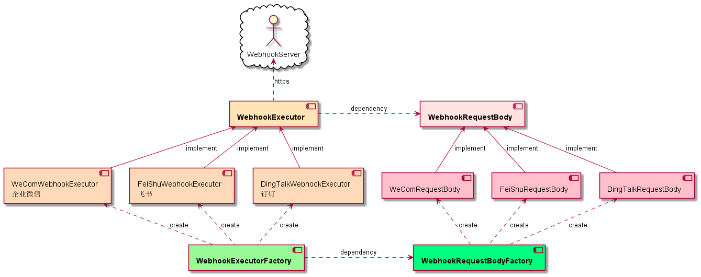
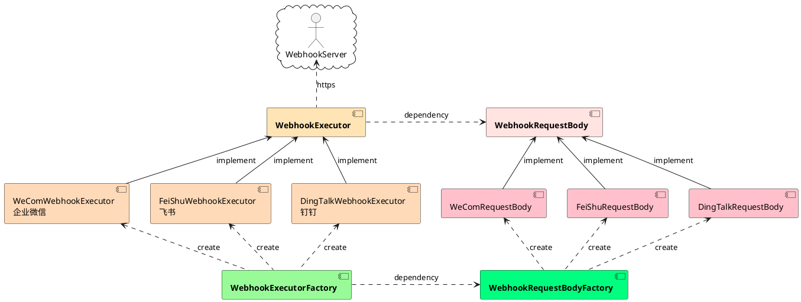

# woodwhales-common

> free business tools for develop business code quikcly

## 一、常用小工具

### 1.1 DataTool

> 旧集合转新集合操作

使用示例：[cn/woodwhales/common/example/business/DataToolExample.java](https://github.com/woodwhales/woodwhales-common/blob/master/src/main/java/cn/woodwhales/common/example/business/DataToolExample.java)

### 1.2 CollectionMath

> 集合元素交集、并集操作

使用示例：[cn/woodwhales/common/example/business/collection/CollectionMathResultExample.java](https://github.com/woodwhales/woodwhales-common/blob/master/src/main/java/cn/woodwhales/common/example/business/collection/CollectionMathResultExample.java)

### 1.3 ChineseDataTool

> 中文字段排序操作

使用示例：[cn/woodwhales/common/example/business/chinese/ChineseDataToolExample.java](https://github.com/woodwhales/woodwhales-common/blob/master/src/main/java/cn/woodwhales/common/example/business/chinese/ChineseDataToolExample.java)

### 1.4 MybatisPlusExecutor

> mybatisPlus sql 执行器

### 1.5 ExcelTool

> excel 文件读取操作

使用示例：[cn/woodwhales/common/example/util/excel/ExcelToolExample.java](https://github.com/woodwhales/woodwhales-common/blob/master/src/main/java/cn/woodwhales/common/example/util/excel/ExcelToolExample.java)

### 1.6 DataSourceTool

>   数据库执行器

使用示例：[cn/woodwhales/common/example/util/datasource/DataSourceToolExample.java](https://github.com/woodwhales/woodwhales-common/blob/master/src/main/java/cn/woodwhales/common/example/util/datasource/DataSourceToolExample.java)

### 1.7 TreeTool

>   list 转 tree

使用示例：[cn/woodwhales/common/example/business/tree/TreeToolExample.java](https://github.com/woodwhales/woodwhales-common/blob/master/src/main/java/cn/woodwhales/common/example/business/tree/TreeToolExample.java)

### 1.8 FileEncryptoTool

> 将文件加密成功指定格式文件，将已加密成指定格式的文件解密回原格式文件

使用示例：[cn/woodwhales/common/example/file/FileEncryptToolExample.java](https://github.com/woodwhales/woodwhales-common/blob/master/src/main/java/cn/woodwhales/common/example/file/FileEncryptToolExample.java)

## 二、webhook

通用 webhook 工具

### 2.1 常用通讯产品接口文档

|  产品   | 接口文档  |
|  ----  | ----  |
|  企业微信  | https://work.weixin.qq.com/api/doc/90000/90136/91770  |
| 钉钉  | https://developers.dingtalk.com/document/app/custom-robot-access |
| 飞书  | https://open.feishu.cn/document/ukTMukTMukTM/ucTM5YjL3ETO24yNxkjN |

### 2.2 架构设计

#### 2.2.1 核心组件

WebhookRequestBody 数据请求对象

WebhookExecutor 请求执行器

WebhookExecutorFactory 请求执行器工厂

WebhookRequestBodyFactory 数据请求对象工厂

#### 2.2.2 组件关系图



### 2.3 代码示例

#### 2.3.1 spring-boot 项目使用示例

> 具体使用示例参见：
>
> [src\main\java\cn\woodwhales\common\example\webhook\ApplicationEventConfig.java](https://github.com/woodwhales/woodwhales-common/blob/master/src/main/java/cn/woodwhales/common/example/webhook/ApplicationEventConfig.java)
>
> [src/main/java/cn/woodwhales/common/example/webhook/IndexController.java](https://github.com/woodwhales/woodwhales-common/blob/master/src/main/java/cn/woodwhales/common/example/webhook/IndexController.java)

步骤1：监听 cn.woodwhales.webhook.event.WebhookEvent 事件，并注入通知地址。

```java
package cn.woodwhales.common.example.webhook;

import cn.woodwhales.common.webhook.event.WebhookEvent;
import cn.woodwhales.common.webhook.event.WebhookEventHandler;
import cn.woodwhales.common.webhook.plugin.WebhookExtraInfo;
import lombok.extern.log4j.Log4j2;
import org.springframework.beans.factory.annotation.Value;
import org.springframework.context.annotation.Bean;
import org.springframework.context.annotation.Configuration;
import org.springframework.context.event.EventListener;

import java.util.concurrent.TimeUnit;

/**
 * webhook使用示例
 * @author woodwhales on 2021-09-15 12:13
 */
@Log4j2
@Configuration
public class ApplicationEventConfig {

    /**
     * 在 application.yml 中配置 notice.url
     */
    @Value("${notice.url}")
    private String noticeUrl;

    /**
     * 项目基包路径
     */
    private String basePackageName = "cn.woodwhales.webhook";

    /**
     * 注入 webhook 插件
     * @return WebhookExtraInfo
     */
    @Bean
    public WebhookExtraInfo webhookExtraInfo() {
        return new WebhookExtraInfo(5, TimeUnit.MINUTES);
    }

    /**
     * 监听 WebhookEvent 事件
     * @param webhookEvent
     */
    @EventListener
    public void handleCustomEvent(WebhookEvent webhookEvent) {
        WebhookEventHandler.handleCustomEvent(webhookEvent, noticeUrl, basePackageName, webhookExtraInfo());
    }

}
```

步骤2：在业务代码中发布 WebhookEvent 事件即可。

```java
package cn.woodwhales.common.example.webhook;

import cn.woodwhales.common.webhook.event.WebhookEvent;
import cn.woodwhales.common.webhook.event.WebhookEventFactory;
import org.springframework.beans.factory.annotation.Autowired;
import org.springframework.context.ApplicationEventPublisher;
import org.springframework.web.bind.annotation.GetMapping;
import org.springframework.web.bind.annotation.RequestMapping;
import org.springframework.web.bind.annotation.RequestParam;
import org.springframework.web.bind.annotation.RestController;

/**
 * webhook 使用示例
 * @author woodwhales on 2021-07-16 20:46
 */
@RestController
@RequestMapping("test")
public class IndexController {

    @Autowired
    private ApplicationEventPublisher applicationEventPublisher;

    private RuntimeException exception = new RuntimeException("报错啦");

    /**
     *
     * @param content
     * @return
     */
    @GetMapping("/send")
    public String send(@RequestParam("content") String content) {

        // 方式1 显示创建指定webhook事件对象
        example1(content);

        // 方式1 不用显示创建指定webhook事件对象，根据通知发送链接自动识别创建对应的webhook事件对象
        example2(content);

        return "ok";
    }

    private void example1(String content) {
        WebhookEvent webhookEvent = WebhookEventFactory.dingTalk(this, "测试标题", exception, request -> {
            request.addContent("content：", content);
            request.addContent("key：", content);
        });
        applicationEventPublisher.publishEvent(webhookEvent);
    }

    private void example2(String content) {
        WebhookEvent webhookEvent = WebhookEventFactory.newWebhookEvent(this, "测试标题", exception, request -> {
            request.addContent("content：", content);
            request.addContent("key：", content);
        });
        applicationEventPublisher.publishEvent(webhookEvent);
    }

}

```

#### 2.3.2 非 spring-boot 项目使用示例

> 具体使用示例参见：[src/main/java/cn/woodwhales/common/example/webhook/WebhookExecutorTest.java](https://github.com/woodwhales/woodwhales-common/blob/master/src/main/java/cn/woodwhales/common/example/webhook/WebhookExecutorTest.java)

方式1：

```java
@Test
public void DingTalkExecutor() {
    String url = "https://oapi.dingtalk.com/robot/send?access_token=zzz";

    BaseWebhookRequestBody requestBody = WebhookRequestBodyFactory.newInstance(WebhookProductEnum.DING_TALK, "test title");
    requestBody.addContent("key1：", "value1");
    requestBody.addContent("key2：", "value2");
    requestBody.addContent("key3：", "value3");

    GlobalInfo globalInfo = new GlobalInfo(new NullPointerException("报错啦"), "cn.woodwhales.webhook");
    requestBody.addGlobalInfo(globalInfo);

    WebhookExecutorFactory.execute(url, requestBody);
}
```

方式2：

```java
@Test
public void WeComExecutor() {
    String url = "https://qyapi.weixin.qq.com/cgi-bin/webhook/send?key=yyy";

    WebhookExecutorFactory.execute(WebhookProductEnum.WE_COM, url, "test title", req -> {
        req.addContent("key1：", "value1");
        req.addContent("key2：", "value2");
        req.addContent("key3：", "value3");
        GlobalInfo globalInfo = new GlobalInfo(new NullPointerException("报错啦"), "cn.woodwhales.webhook");
        req.addGlobalInfo(globalInfo);
    });
}
```

### 2.4 附件

#### 2.4.1 组件关系图 plantUml 源码

